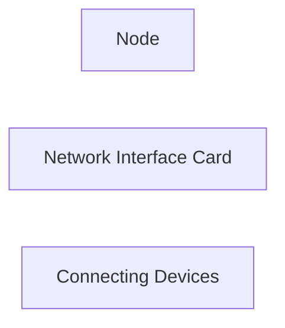

# 
 Local Area Networks pg48

A computer network is a collection of computers or other devices connected by nodes connected by some communication channel.

**_Node_** - any device connected to a network

## Communication Media

Comes in 3 ways

1. _Sender._
2. _Connection. (communication channel / transmission media)_
3. _Receiver._

Communication channel has a **_bandwidth_** (the maximum amount of data that it can transfer per unit time.)

## Network Hardware Components

### Nodes

Any device connected on the network

### Network Interface Card

### Connecting Devices

As in switch
