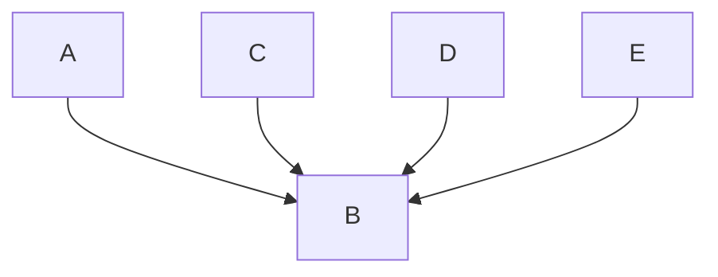
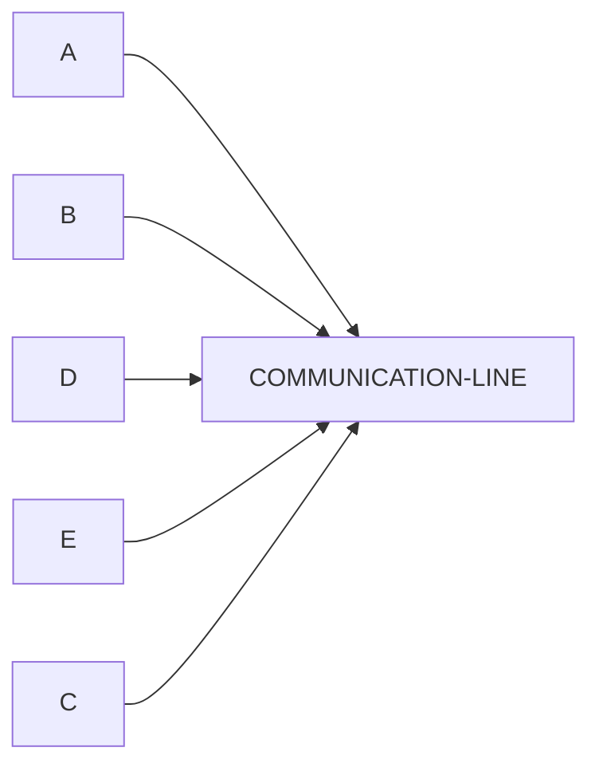
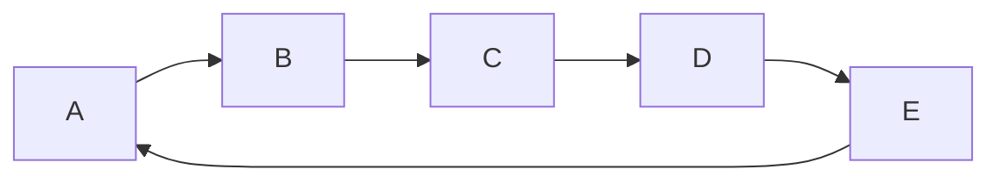

# 
 Topology\*

Layout or structure of a network.
Defines how nodes are connected.

## Star

All nodes are connected to a central node.

| Advantages                                     | Disadvantages                                      |
| ---------------------------------------------- | -------------------------------------------------- |
| Easier to install and manage                   | Central device failures affects the entire network |
| If one cable fails, the rest remain unaffected | More cabling needed                                |

## Bus

All device share a single topology line

| Advantages            | Disadvantages             |
| --------------------- | ------------------------- |
| Requires less cabling | Network slows traffic     |
| Easy to implement     | Difficult to troubleshoot |

## Ring

Each devices connected to two others forming a ring.

| Advantages                                                        | Disadvantages                                              |
| ----------------------------------------------------------------- | ---------------------------------------------------------- |
| Data flows in one direction which reduces collision               | If one computer goes down, it can affect the whole network |
| Equal access for all devices (No device can get more data than a) | Difficult to reconfigure                                   |

|

## Hybrid

The combination of two or more different topologies.

| Advantages                               | Disadvantages          |
| ---------------------------------------- | ---------------------- |
| Flexible and Scalable                    | Complex Design         |
| Combines strengths of various topologies | Expensive to implement |
