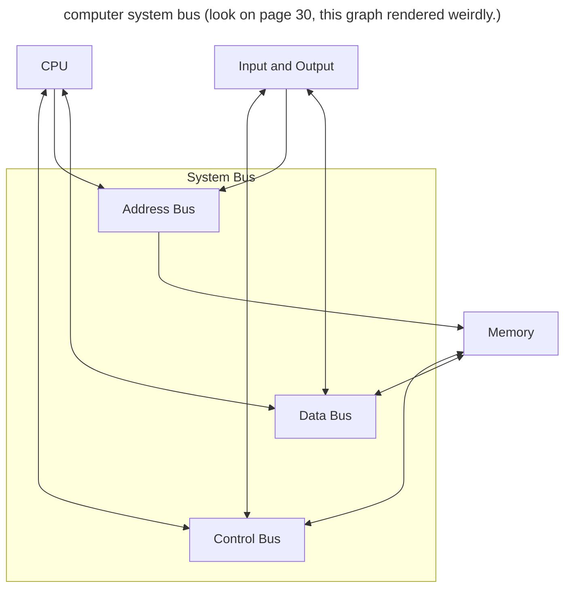

# Motherboard pg 29

-   the central printed board that connects components and devices to each other.
-   the standard motherboard will host a variety of components such as the CPU and RAM.
-   Busses are needed to connect the components and devices

## System Clock

-   The microchip that regulates the timing and speed of all computer funtions.

-   The shortest time a computer can perform somethign is **one clock or one vibration** of the clocki chip. The speed of the computer is easured in clock speed, where _1 MHz is one million cycles/vibrations per second._

### Overclocking

-   The practice of making computer components run faster than usual by manipulating the frequencies at which the component is set to run.
-   This is achieved either:
-   -   **per component** (The CPU operates faster than the system clock)
-   -   **the whole system** (the system clock is increased)

Running components faster than intended can cause them to wear out or fail or become unstable. Most overclocking techniques come with more power consumed and more heat generated.

## Speed vs Throughput

A CPU is measured in GHz and RAM in MHz.
This stuff needa be conneced via busses to transfer data.

The **speed** of a bus is measured in Mbps or Gbps, often this rate refers to the maximum speed of the bus and due to latency and other factors, the actual speed or **throughput** of data may be reduced

_Speed is referred to as **bandwidth**_ and is the theoretical speed of data, whereas throughput is the actual speed of data.

## FSB (Front Side Bus)

The FSB (or Internal Bus) **was** a parallel bus that connected all components on the motherboard. Sice then point to point serial connections replaced FSB.

### Data Bus

- Transfers the actual instruction or data between the CPU 
and RAM.
- The number of bits that the bus can deliver to the CPU
dictates the size of the registers on the CPU

### Address Bus

- Transfers the physical address of the instruction or data between the CPU and RAM.
- A 64-bit Address bus can address more memory than
a 32-bit address bus but this does not create more memory.

### Control Bus

- Carries commands between the CPU and RAM.

## External Buses

These attach external devices

### PCIe

**P**eripheral **C**omponent **I**nterconnect **E**xpress
slots are used to connect **Graphics Cards**, **RAID Cards**,
**WI-FI Cards** or **SSDs**

Connects CPU to high speed components, by using lanes
(x1, x4, x16)

> NVMe SSDs communicate with the CPU via PCIe

### SATA

**S**erial **A**dvanced **T**echnology **A**ttachment is
an interface which connects mass storage devices, like
**hard drives** (mechanical or solid state). (Old)

| Gen         | Speed  | Throughput |
|-------------|--------|------------|
| SATA \|     | 1.5GHz | 150MB/s    |
| SATA \|\|   | 3GHz   | 300 MB/s   |
| SATA \|\|\| | 3 GHz  | 600 MB/s   |

- SATA interfaces are backwards compatible with each other at the
cost of loosing data access speed. E.g. **SATA ||** interface
wll work on **SATA |** ports.

> SATA based SSDs communicate over the SATA bus technology
> which is older. SATA SSDs require both the SATA data cable
> and the SATA power cable. But M.2 SATA SSDs only need to
> connect to the M.2 slot

### USB

**U**niversal **S**erial **B**us technology was designed
to standardise the connection of any peripherals to
computers. 

| Gen                | Data Transfer Rate |
|--------------------|--------------------|
| USB 1.0/Low-Speed  | 1.5Mbps            |
| USB 1.1/Full-Speed | 12Mbps             |
| USB 2.0/Full-Speed | 480Mbps            |
| USB 3.0/SuperSpeed | 5Gbps              |
| USB 3.1/SuperSpeed | 10Gbps             |

### NVMe

**N**on-**V**olatile **M**emory **E**xpress is a protocol
that defines how **SSDs communicate to the motherboard over PCIe**.

This bus allows much **higher speed** than via a SATA 
communication bus.

The "language" SSDs use over PCIe

### M.2 Format

M.2 is a form factor that describes the shape amd size of a hardware
device. The M.2 Connector can access the PCI-express 3.0,
SATA 3.0 and USB 3.0 bus depending on the type of M.2
device.

An M.2 slot can carry different protocols of data.
See [Secondary Storage](./4%20-%20secondary%20storage.md)
