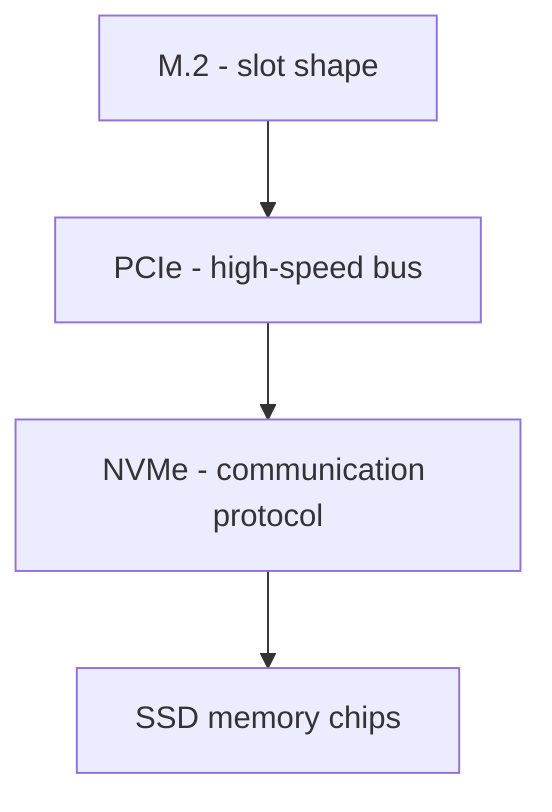

Danko bigGPT

---

# 🧱 1. SATA (Serial Advanced Technology Attachment)

What it is:

> A data transfer interface (bus standard) for storage devices

What it does:

- connects storage (SSD/HDD) to motherboard
- uses cables
- has speed limits (~550 MB/s)

What uses it:

- SATA HDDs
- SATA SSDs
- sometimes M.2 SATA SSDs

SSD → SATA cable → motherboard SATA port

Key idea:

> SATA = older “road system” for storage devices

---

# ⚡ 2. PCIe (Peripheral Component Interconnect Express)

What it is:

> A high-speed data bus system

What it does:

- connects CPU to high-speed components
- used for GPUs, NVMe SSDs, WiFi cards, etc.

Key feature:

- uses “lanes” (x1, x4, x16)
- much faster than SATA

Device → PCIe lanes → CPU/motherboard

Key idea:

> PCIe = modern high-speed highway system inside the PC

---

# 🚀 3. NVMe (Non-Volatile Memory Express)

What it is:

> A storage communication protocol

**_NOT hardware. NOT a slot._**

What it does:

- defines how SSD talks to system over PCIe
  = optimized for fast SSDs
- supports parallel command queues

Key idea:

> NVMe = the “language” SSDs use over PCIe

---

# 🧩 4. M.2

What it is:

> A physical form factor / connector shape

_**NOT speed. NOT protocol.**_

What it defines:

- small stick-shaped SSD
- plugs directly into motherboard slot

But M.2 can carry:

- SATA (slow)
- PCIe/NVMe (fast)

M.2 slot = physical socket on motherboard

---

🔥 Now put it all together

A full NVMe SSD setup looks like this:

---

# 🧠 Clean classification

📦 Physical layer
> M.2

🚚 Transport layer (bus)

> SATA

> PCIe

🧾 Communication protocol

> NVMe (for SSDs)

---

🧠 The real mental model

Think of it like:

Layer	Example

Shape	M.2
Road system	SATA / PCIe
Language	NVMe

---

🧾 One-line summary

> SATA and PCIe are data transfer bus standards, NVMe is a storage communication protocol that runs over PCIe, and M.2 is just the physical connector form factor — textbooks group them together because they all relate to storage connectivity, even though they operate at different architectural layers.
