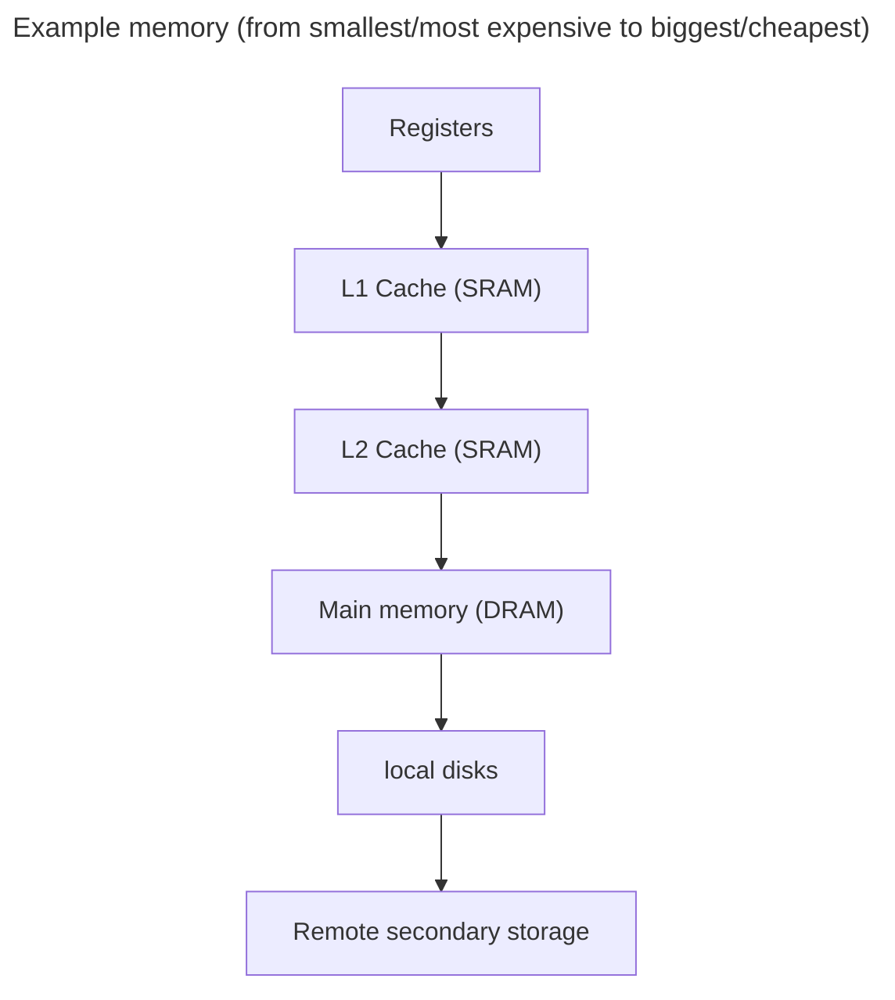

# RAM pg 27

-   the main memory in chips on modules attached to dedicated slots on the motherboard
-   RAM stores the **programs** in use and the **data** associated with them.

Commonly used RAM is called **_`Double Data Rate (DDR) SDRAM`_**

-   **_DRAM_** (Dynamic) RAM is the type of chip used for this memory. Each contains a capacitor whih loses its charge and must be refreshed many times /s
-   **S**DRAM stand for _**Synchronous**_ DRAM. The refreshing of the RAM chips is snchronised with the CPU so the CPU doesn't wait while transfers take place.
-   **_Double Data Rate_** - means data is transferred twice as fast as when data was transferred only once every clock pulse.

## Latency

-   The time taken for a component to respond to input.

-   e.g. L1 cache has less latency than L2; which is why it's so efficient.

## Types of memory

