# CPU Design pg 22

## CPU Design

```mermaid
graph TD;
O[Other Registers]
ALU
M[Memory Address Register]
C[Control Unit]
MD[Memory Data Register]
E[Electronic Clock]
    subgraph CPU
        O  ==> ALU;
        ALU <==> C;
        O <==> M
        O <==> MD
    end


    M <---> |🖂 Address Bus|Main-Memory;
    MD <-->|📦 Data Bus| Main-Memory;
    C <-->|⚡ Control Bus| Main-Memory;
    E --> C;
```

### (CU) Control Unit

-   Controls the execution of each intructions.

It sends read or write signals to memory and the address of the instruction (or data) to be fetched (or stored, in the case of data).

-   The instruction/data fetched from memory is stored in the registers in the CU or in **[registers](#registers)** in the **[ALU](#alu-arithmetic-logic-unit)**

### (ALU) Arithmetic Logic Unit

-   Computes addition, subtraction and logical comparisons.

Once processed data may be sent back to memory to be stored there.

-   _The **`accumulator`** is the register that stores the result of each execution. When data is saved it is written from the accumalator to RAM. When data is loaded, vice versa._

### Registers

-   Store the current instruction and its data **`static RAM (sRAM)`**.

    -   sRAM is extremely fast but very expensive too.
    -   sRAM also does not contain capacitors that need to be constantly read, which increases access time.

CPU Registers can be **_32_** or **_64_** bits.
A CPU with _n_-bit registers can process data in _n_-bit groups. (This means a 32-bit CPU must process 64-bit numbers in two stages. While a 64-bit one, 1 stage.) **_(This does not imply that the 64-bit processer will be twice as fast as a 32-bit processor. Other factors can influence perfor4mance e.g. 64-bit code will have a higher memory consumption)_**

### Serial Processing

-   CPU which can only process 1 instruction at a time (old CPUs)
-   The processor had a single core where the problem was broken into a set of instructions that are executed sequentially.

t = instruction

### Parallel processing

-   A method of simultaneously breaking up and running program instructions on multiple microprocessors, thereby reducing processing time.

-   Each part is broken down into its individual set of instructions and each instruction is run on a different processor.

_(example: if a user is running multiple programs at the same time, each program can run on its own processor)_

 t...N is split into multiple sets of instructions 

**_(CPU doesn't work as showuin in the above diagram, this is just for demonstration purposes, see page 23.)_**

#### Hyperthreading

-   Hyper Threading was developed before it was possible to create seprate cores on a single processor chip.
-   It allowed registers to **preload** the next instruction into a second set of registers while the first set of registers was being processed reducing the time it took to switch between instructions.

-   It allowed the processor to **_appear to execute two sets of instructions_** at the same time.
-   Each set of instructions is called a _*`thread`*_, with the entire program to be processed being reffered to as a _*`process`*_

-   _In an OS, a hyperthreaded CPU appears like two **logical CPUs** where in fact there is only one physical CPU with two sets of registers_

-   _While it can improve processing performance, it must be supported by the OS. e.g. A video playing in Media Player shouldn't be slowed down by a werb page loading in Internet Explorer._

#### Multiprocessing

-   is having multiple CPUs (**_`cores`_**) on a single CPU chip. Instead of duplicating only the registers the entire core was duplicated on the CPU chip.

-   By having multiple cores, many processes can **ACTUALLY** run at the same time.

_
Where AS = Architectural State
_
_
(eax, ebx, control registers, etc.)
_

#### Modern CPUs

**_*Not a topic in the textbook, but for my own notes*_**

-   provide both multiprocessing and hyperthreading, where a CPU has more than one core and each core is hyperthreaded

_
ss of my laptop's CPU in Task manager
_

_
My CPU has 2 **physical** cores, each hyperthreaded to produce 4 **logical** cores.
_

The number of cores, the speed of the CPU and the register size all have an individual effect on the performance of the CPU, but a compounded effect when considered in combination.

The rule of more is better essentially.

F = **perfoamnce "factor"**

**$F(p, s) = ps$**

_where p is the amount of processors and s is the speed of the CPU_

Example:

a dual core (**2** processors, 1 chip) CPU running at **3**GHz would have a _performance "factor"_ of : $2 * 3 = 6$

and a quad core (2 processors on 2 chips) running at 2.13GHz would have a _performance "factor"_ of : $4 * 2.13 = 8.52$

Therefore the quad core **should** perform better as it has a higher _performance "factor"_.

### Processor Cache

The CPU will often be waiting whilst the next instruction is fetched from slower RAM. because we dont want the CPu to be idle, we can remove this problem by allocating

-   a small amount of fast memory on or near the CPU which is used to store the next batch of instructions and their related data.

(Located between the CPU and RAM) Cache memory exists which is made from **_`SRAM (static RAM)`_**, which has a faster access speed than **_`DRAM (dynamic RAM, normal RAM)`_**

_
Note: Most CPUs dont follow this exact procedure and this isn't exactly how the cores will try to access memory, the arrows just indicate which it tries in which order
_

**_In real architecture, L3 is closer to both cores than shown above, it just rendered weird. but L3 is essentially the bridge inbetween the stuff and the Main memory. And L3 isn't on all motherboards but on many._**

_Level 1 Cache_ - very small amount of memory with usually the same speed as the CPU

_Level 2 Cache_ - slighlty further away from the internal CPU, with L2 being slightly larger than L1 and has slower access running at half the CPU's sped.

_Level 3 Cache_ - Most motherboards have an L3 on the actual board, and is like L2 is to L1, slower and larger than L2 is.

The CPU will check for data on L1 first, then L2, then L3 and finally the slower RAM.

(Most L3 holds copies of instructions frequently used by multiple cores that shre it. Most modern CPUs have builtin L1 and L2 caches per core and share a single L3 cache on the motherboard, while others have the L3 on the CPU die itself)

 

**_`Cache`_** - stores data so that future requests for that data can beserved faster.
