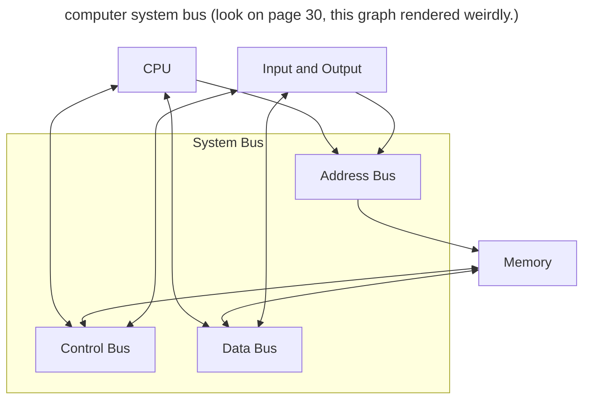

# Motherboard pg 29

-   the central printed board that connects components and devices to each other.
-   the standard motherboard will host a variety of components such as the CPU and RAM.
-   Busses are needed to connect the components and devices

## System Clock

-   The microchip that regulates the timing and speed of all computer funtions.

-   The shortest time a computer can perform somethign is **one clock or one vibration** of the clocki chip. The speed of the computer is easured in clock speed, where _1 MHz is one million cycles/vibrations per second._

### Overclocking

-   The practice of making computer components run faster than usual by manipulating the frequencies at which the component is set to run.
-   This is achieved either:
-   -   **per component** (The CPU operates faster than the system clock)
-   -   **the whole system** (the system clock is increased)

Running components faster than intended can cause them to wear out or fail or become unstable. Most overclocking techniques come with more power consumed and more heat generated.

## Speed vs Throughput

A CPU is measured in GHz and RAM in MHz.
This stuff needa be conneced via busses to transfer data.

The **speed** of a bus is measured in Mbps or Gbps, often this rate refers to the maximum speed of the bus and due to latency and other factors, the actual speed or **throughput** of data may be reduced

_Speed is referred to as **bandwidth**_ and is the theoretical speed of data, whereas throughput is the actual speed of data.

## FSB (Front Side Bus)

The FSB (or Internal Bus) **was** a parallel bus that connected all components on the motherboard. Sice then point to point serial connections replaced FSB.

### Data Bus

-   Transers the actual instruction or data between the CPU and RAM.
-   The number of bits that the bus can deliver to the CPU dictates the size of the registers on the CPU

### Address Bus

-   Transfers the physical adress of the instruction or data between the CPU and RAM.
