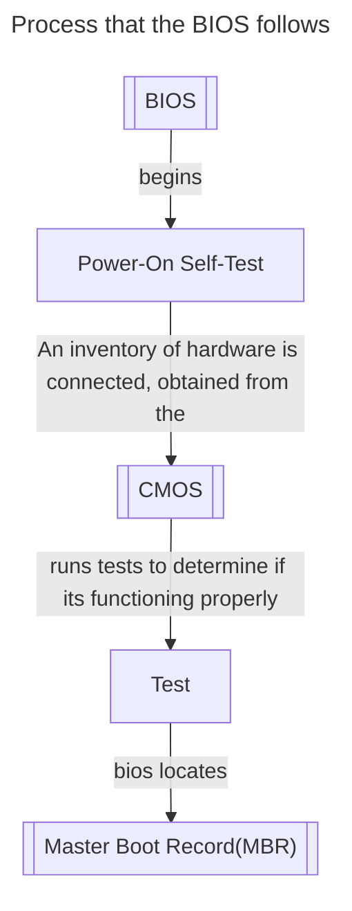

# Start-up and boot software pg 37

When the computer is switched on, and before the OS is loaded, the hardware devices that will be used need to be checked.

Once they are deemed to be correct, the OS on the main drive gets loaded in RAM together with drivers for the hardware devices.

A **_`boot sequence`_** is the initial set of operations that the computer performs when it's turned on.

The program that performs the boot sequence and ends in the entire OS being loaded is the **_`boot loader`_** (or **_`bootstrap loade`_**)

## BIOS

The **B**asic **I**nput **O**utput **S**ystem is low-level software that lives in a non-volatile ROM chip on the motherboard.

Software that lives on the ROM permanently is known as **_`Firmware`_**

When the computer turns on the following happens

-   MBR - **M**aster **B**ot **R**ecord, which is a seciton of code usually stored on the hard disk drive. Its responsible for loading and exeucting the OS's **[`kernel`](#kernel)** which continues the start up procedure

### Kernel

The core of the computer's OS which remains in RAM. It's responsible for I/O requests from software, translating them into instructions for the CPU. It also handles memory and peripherals like keyboards, monitors, printers and speakers.

## CMOS

**C**omplementary **M**etal-**O**xide **S**emiconductor
A battery-backed, volatile memory that stores:

-   hardware settings
-   user settings

CMOS is referred to by the BIOS in the boot up process to obtain data about the system.

CMOS memory needs to be volatile since users can install different hardware devices and change user settings.
